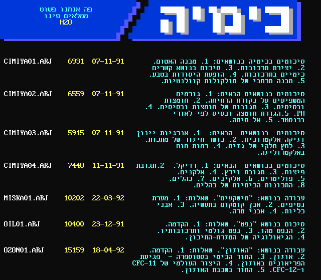
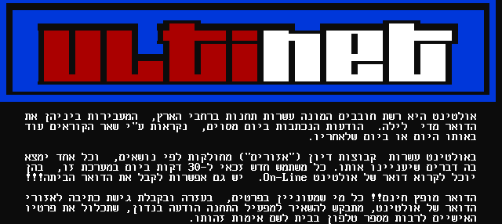
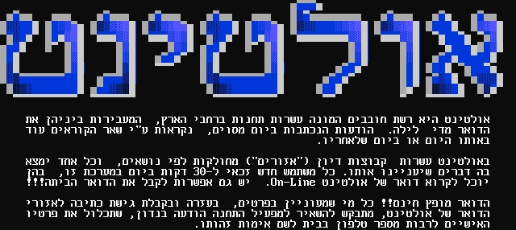

# hTXT Viewer

A set of tools for viewing Hebrew DOS Text files. 

This tool supports viewing old DOS plaintext files written in Hebrew (*[Code page 862](https://en.wikipedia.org/wiki/Code_page_862)*, a.k.a *MS-DOS Hebrew* or *OEM Hebrew*). 

Basic ASCII Art via *[Code page 437](https://en.wikipedia.org/wiki/Code_page_437)* is supported as well, as well as some [ANSI escape codes](https://en.wikipedia.org/wiki/ANSI_escape_code). In order to accurately display the ASCII art, a fixed width font ([Classic Console Neue](http://webdraft.hu/fonts/classic-console/)) is used.

## Tools

### Online Viewer

An online viewer can be found [here](https://dvd848.github.io/hTXT-Viewer/hTXT.html). The viewer converts the old text files to UTF-8, and allows exporting the result to an image. Since Code Page 437 was frequently used in [NFO Files](https://en.wikipedia.org/wiki/.nfo), this tool can be considered a basic **Online NFO Viewer** as well.


### Python Script

The Python script under `scripts` can be used to convert the text files to images or UTF-8 text files. 

```console
$ python3 hTXT.py -h
usage: hTXT.py [-h] [-w CONSOLE_WIDTH] [-s] [-f {image,text}] (-i INPUT | -id INPUT_DIR) [-o OUTPUT | -od OUTPUT_DIR]

Decode old Hebrew text files encoded with Code Page 862

options:
  -h, --help            show this help message and exit
  -w CONSOLE_WIDTH, --console-width CONSOLE_WIDTH
                        Console width
  -s, --skip_ansi       Skip ANSI Color codes
  -f {image,text}, --format {image,text}
                        Output format
  -i INPUT, --input INPUT
                        Input file
  -id INPUT_DIR, --input-dir INPUT_DIR
                        Input directory
  -o OUTPUT, --output OUTPUT
                        Output file
  -od OUTPUT_DIR, --output-dir OUTPUT_DIR
                        Output directory
```

The default is to export the source text files to an image. 

While an image output format is usually able to accurately represent the original file layout,
converting to a UTF-8 text file sometimes has minor formatting issues. This is mainly due to 
the fact that the conversion process includes translation from Visual Hebrew to Logical Hebrew,
a procedure which was not designed to maintain formatting such as ASCII art.

Example usage:

```console
$ # Will save the output file to the same directory as the input file
$ python3 ./hTXT.py -i /home/user/input/file1.ans
Parsing '/home/user/input/file1.ans'
Saved to '/home/user/input/file1.png'

$ # Will save the output file to the same directory as the input file
$ python3 ./hTXT.py -i /home/user/input/file1.ans --format image
Parsing '/home/user/input/file1.ans'
Saved to '/home/user/input/file1.png'

$ # Will save the output file to the provided output path
$ python3 ./hTXT.py -i /home/user/input/file1.ans -o /home/user/output/file1_output.png
Parsing '/home/user/input/file1.ans'
Saved to '/home/user/output/file1_output.png'

$ # Will save the output file to the provided output directory
$ python3 ./hTXT.py -i /home/user/input/file1.ans -od /home/user/output/
Parsing '/home/user/input/file1.ans'
Saved to '/home/user/output/file1.png'

$ # For each file under the input directory, will save a matching output file under the output directory
$ python3 ./hTXT.py -id /home/user/input/ -od /home/user/output/
Parsing '/home/user/input/file1.ans'
Saved to '/home/user/output/file1.png'
Parsing '/home/user/input/child/file2.asc'
Saved to '/home/user/output/child/file2.png'

$ # Save as a text file
$ python3 ./hTXT.py -i /home/user/input/file1.ans -o /home/user/output/out.txt --format text
Parsing '/home/user/input/file1.ans'
Saved to '/home/user/output/out.txt'

```

The script depends on the `Pillow` (`PIL` fork) library:

```console
$ python3 -m pip install --upgrade Pillow
```

For text conversion, the `python-bidi` package is needed as well:

```console
$ python3 -m pip install --upgrade python-bidi
```


## Examples

These examples were contributed by Uri Tidhar (Anaesthesia BBS Archive) and received from [@hananc](https://twitter.com/hananc) as part of the [Israeli Digital History Preservation Project](https://digital-archive.org.il/). 

If you have additional materials, please [contact Hanan](https://digital-archive.org.il/donate-materials/) and help preserve the history of Israeli computing!

The original text files are available under the `examples` folder.

### Image Output



***


***


***


***


***



***



### Text Output


***


***


***


***

The text output is best viewed in an editor which supports a fixed-width font (such as Notepad++), with right-to-left text alignment.